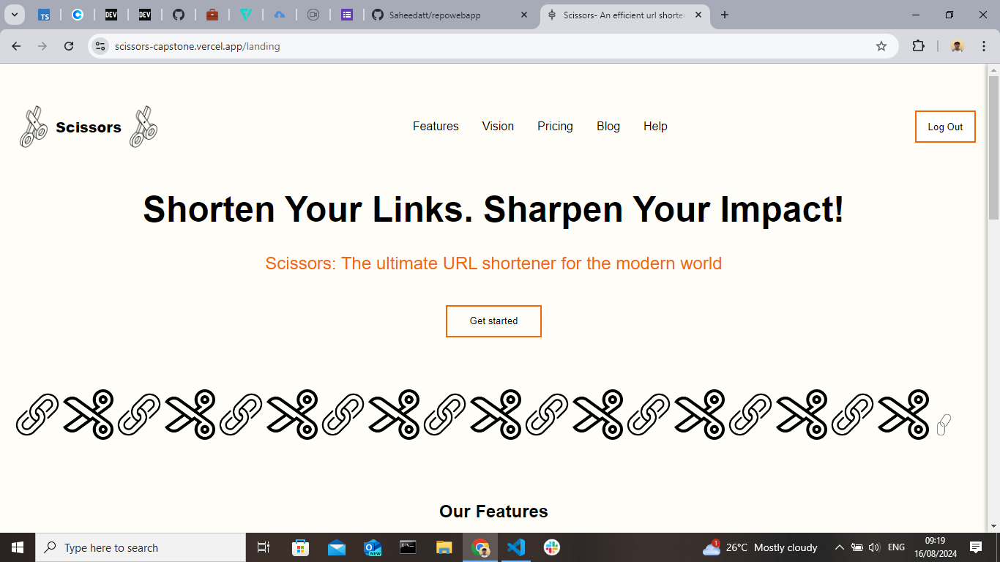

# Scissors - An efficient url shortening tool

Capstone project for AltSchool Africa.

## Project Overview

Scissors is a url-shortening app designed to make urls as short as possible, making links easier to read and use. It includes features like Qr-code generation, Custom url generation and Analytics.

The app allows users to shorten long URLs and redirect to the original URLs.
This project consists of a frontend application built with Vue.js and Typescipt and Firebase was used for authentication and data storage.

## Features

- URL Shortening: Application receives long urls from users and makes it into shorter and more manageable URLs.

- Custom Urls: Allows users to customize their shortened URLs. Users can customize the URL to reflect their brand or content.

- QR Code Generation: Application allows users to generate QR codes for the shortened URLs. Users can download and use the generated QR code in other applications.

- Analytics: Scissors provides an analytics feature that allows users to track the performance of their already shortened URLs. This means that they can see how many clicks their URL has received.

- Authentication: Users have to be logged in to be able to access the features of the application. It also ensures that they get to see their previously shortened links and it's activity.

## Architecture and Technologies used

- Frontend: It was built with:

  - Vue.js was used to provide a responsive and interactive interface with good SEO.
  - TypeScript was used with Vue.js for the improved code quality and error detection
  - Vue Router: For routing.
  - Vanilla CSS: For styling.

- Backend: Firebase and Firestore was used for User Authentication and storage of the shortened Url.

- Tools:
  - Vite
  - Node.js
  - pnpm

## Project Structure

The project is organized as follows:

- **src/components**: Contains Vue components such as `UrlShortener.vue`, `QrCode.vue`, and `History.vue`.
- **src/routing/index.ts**: Manages the application routing using Vue Router.
- **src/composables**: Contains reusable composition API logic, like `useFirebase.ts` for Firebase interactions.
- **src/style.css**: Contains global styles for the project.

## Special Features:

- The QR Code generator: In the `Qr.vue` component, the QR code is generated using the `qrcode package`. The user inputs a URL, and the application generates a QR code that is scannable. This image is downloadable as a PNG image.

- Validation: Validation ensures that entered input is a url. The `Validator.js` package is used to implement this feature.

- Pagination: The `History.vue` component displays previously shortened URLs with pagination. It shows 15 URLs per page, allowing users to navigate through their URL history efficiently.

## Testing

This project includes unit and component tests to ensure the reliability of the application. The tests are written and executed using Vitest, a Vite-native test framework that allows for fast and efficient testing with great integration in Vite projects.

- ### Unit Testing
  Unit tests were created to verify the functionality of individual units of functions in the code. These tests ensure that each unit performs as expected under various conditions. - Unit tests were performed on the routing/index.ts file and the Validation function. - For the validation function to be tested, it was extracted into a `utils` folder first.
- ### Component Testing
  Component tests were performed to verify the behavior and rendering of Vue components in isolation. They check to see if components render correctly, handle users interactions appropriately and manage state as intended.
- `Landing.vue` for example ensures that all main elements are rendered correctly and that routes are navigated to appropriately depending on the user's authentication status.
- `Features.vue` and `Footer.vue` also had component tests written for them.

### Project Screenshot

### Live Link

- [Scissors](https://scissors-capstone.vercel.app/landing)

### Acknowledgements

- Mr Setemi Ojo
- AltSchool Africa
- Enny

